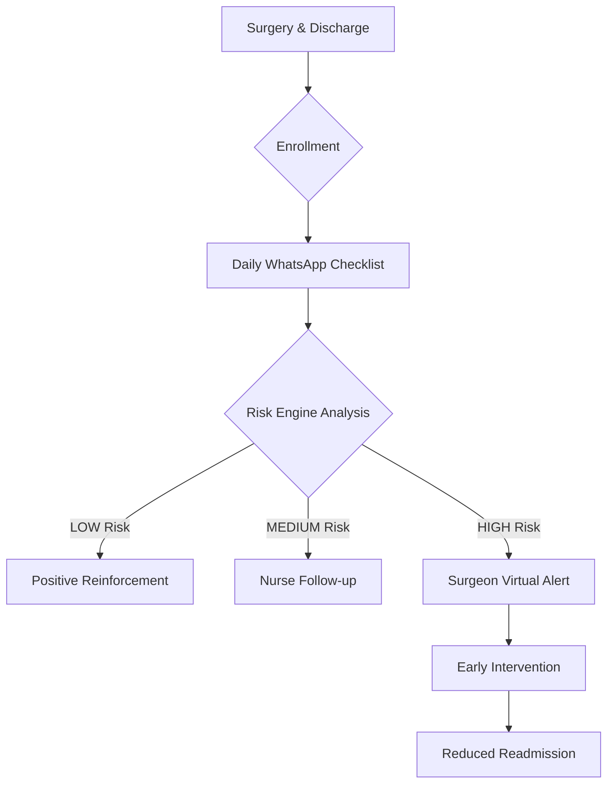

# Suraksha-Setu (OrthoWatch) 🛡️🦴
### *Bridging the Gap Between Discharge and Recovery*

[](https://opensource.org/licenses/MIT)
[](https://spring.io/projects/spring-boot)
[](https://reactjs.org/)
[](https://www.postgresql.org/)

---

## 🌟 Vision
Post-operative care in orthopedics is often a "black box" once the patient leaves the hospital. **Suraksha-Setu** (OrthoWatch) transforms this journey by providing a high-fidelity, remote monitoring bridge that ensures patient safety, surgery success, and clinical peace of mind.

Our mission is to reduce hospital readmissions and detect life-threatening complications (like DVT and sepsis) before they become emergencies.

---

## 🚀 Key Value Propositions

### 📱 WhatsApp-First Engagement
Patients don't want another app. Suraksha-Setu meets them where they are. Using WhatsApp for automated daily checklists ensures **>90% adherence** rates, significantly outperforming standalone clinical apps.

### 🧠 Intelligent Risk Scoring Engine
A proprietary, template-aware engine that evaluates 20+ clinical tokens (Pain, Swelling, Fever, Mobility) to calculate a composite risk score (0-100).
- **Early Warning System**: Automatic detection of worsening trajectories.
- **Predictive Alerts**: Notifies surgeons of HIGH-RISK status instantly.

### 🏥 Surgeon-Centric Dashboard
A premium, dark-mode specialized interface for clinicians to manage their entire patient cohort at a glance.
- **Real-time Recovery Trajectories**: Visualizing improvement vs. worsening.
- **Wound Image Analysis**: (Phase 4) Integrated image tracking for infection control.
- **Immutable Audit Logs**: Every clinical decision is logged for medico-legal compliance.

---

## 🛠️ Technology Edge

### High-Performance Backend
- **Spring Boot 3.2 + JDK 21**: Leveraging Virtual Threads for high-concurrency scheduling.
- **PostgreSQL 16**: Utilizing `JSONB` for flexible recovery templates and rule versioning.
- **Redis 7**: High-speed rate limiting and session management.
- **Quartz/Scheduled Tasks**: Robust automation for reminders and escalations.

### Sleek, Modern Frontend
- **React 18 + Vite**: Lightning-fast UI development and execution.
- **Tailwind CSS 3.4**: A custom-crafted design system with glassmorphism and micro-animations.
- **TanStack Query (React Query)**: Seamless synchronization with the backend.

---

## 📊 The Patient Journey


---

## 🏗️ Architecture Architecture

### Infrastructure
```bash
.
├── backend/            # Spring Boot Core API
│   ├── src/main/java/com/orthowatch/service/     # Rule Engine & Business Logic
│   ├── src/main/java/com/orthowatch/scheduler/   # Automation Layers
│   └── src/main/resources/db/migration/          # Evolution-first Schema (Flyway)
├── frontend/           # Surgeon Dashboard (React)
├── docs/               # Architecture & Clinical Specs
└── docker-compose.yml  # One-click Deployment
```

---

## 👨‍💻 Getting Started

### 1. Prerequisites
- JDK 21+
- Node.js 20+
- Docker & Docker Compose

### 2. Launching the Platform
```bash
# Start Infrastructure (PostgreSQL, Redis)
docker-compose up -d

# Build and Run Backend
cd backend
./mvnw spring-boot:run

# Build and Run Frontend
cd frontend
npm install && npm run dev
```

---

## 🛡️ Clinical Compliance & Security
- **JWT Auth**: Secure, role-based access for clinicians.
- **SLA Tracking**: Automated escalations to ensure 2-hour response for high-risk patients.
- **Data Integrity**: Flyway-managed schema migrations and clinical audit logging.

---

### *Disclaimer*
*Suraksha-Setu is a decision-support tool. Clinical judgment remains paramount.*

Developed with ❤️ for the Orthopedic community.
